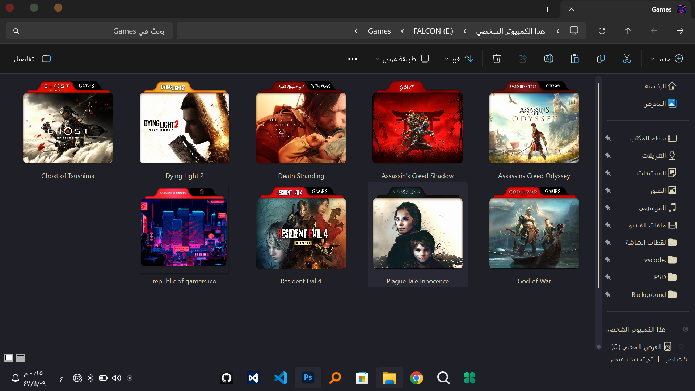

# 🎨 Custom Icons Folder Pack

A high-quality **Windows Folder Icons Pack** featuring **ICO icons**, **PNG previews**, and editable **Photoshop (PSD) source files**.  
Designed for gamers, developers, and creators who want a clean and modern Windows folder setup.

---

## ✨ Features

✅ High-quality **Windows Folder Icons (.ICO)**  
✅ **PNG previews** for quick browsing  
✅ Editable **PSD source files** included  
✅ Clean modern style (Gaming Theme)  
✅ Organized folder structure  
✅ Suitable for Windows customization lovers

---

## 📂 Project Structure
Custom-Icons-Folder-Pack/
│
├── assets/
│ ├── ICO/ # Final Windows icons (.ico)
│ ├── PNG/ # Preview images (.png)
│ └── PSD/ # Photoshop source files (.psd)
│
├── screenshots/ # Screenshots / previews
│
└── README.md


---

## 🖼️ Preview

### 🔥 Gaming Theme Icons
> (You can add more screenshots here)




📌 If previews do not show, make sure the screenshot filenames match exactly (case-sensitive).

---

## ⚙️ How To Use (Windows)

### Method 1: Change Folder Icon Manually
1. Right-click on the folder
2. Choose **Properties**
3. Go to **Customize**
4. Click **Change Icon**
5. Browse and select any `.ico` file from:

assets/ICO/

6. Click **Apply** then **OK**

---

## 🛠️ Advanced Usage (desktop.ini)

You can customize folder icons automatically using a `desktop.ini` file.

Example:

```ini
[.ShellClassInfo]
IconResource=YourIcon.ico,0
IconFile=YourIcon.ico
IconIndex=0

📌 Make sure the folder is set as system folder to apply desktop.ini settings properly.

📥 Download

You can download the full pack from the Releases section:

➡️ Go to: Releases
⬇️ Download: Custom-Icons-Folder-Pack.zip

🚀 Recommended Setup

To keep your folders organized, we recommend naming folders like:

Games
Programs
Work
Projects
Tools
Media
📌 Requirements
Windows 10 / Windows 11
Any software that supports .ico icons
Photoshop (optional, only for editing PSD files)
🧩 Customization

You can fully edit icons using the included PSD files:

assets/PSD/

After editing:

Export PNG preview
Convert to ICO
Replace the icon inside assets/ICO/
📸 Screenshots

All screenshots are stored here:

screenshots/
🏷️ License

This project is licensed under the MIT License.
You are free to use, modify, and share this pack with proper credit.

👤 Author

Created by: FALCONZeroX
📌 GitHub: https://github.com/FALCONZeroX

⭐ Support

If you like this project:

⭐ Star the repo
🍴 Fork it
📢 Share it with others

Enjoy customizing your Windows folders! 🎮🔥
